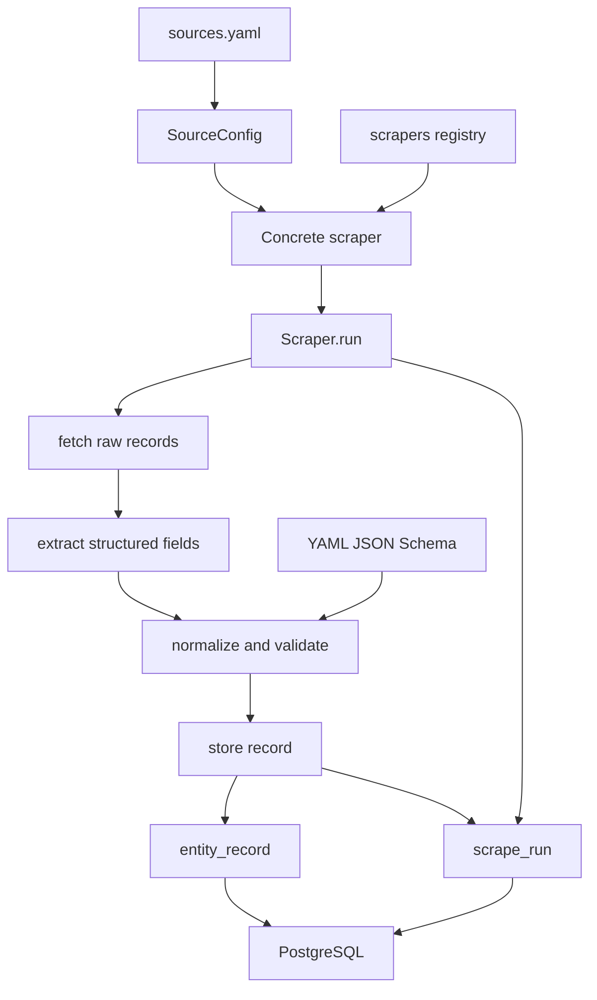

# Ingestion architecture and component boundaries

The architecture separates reusable ingestion orchestration from source-specific acquisition and normalization. This lets new Malaysian data verticals share a storage envelope and audit model while retaining their own fetch/parser logic and JSON Schema.

This diagram shows the code-level pipeline and its database targets. `Scraper.run()` owns stage sequencing and counters; concrete scrapers own the source behavior and database implementation.

## Components

### Source catalogue and registry

`sources.yaml` is the canonical human-maintained catalogue of source metadata: source ID, URL, access type, refresh frequency, scraper status, PDPA risk, licence, and notes. `load_sources()` in `scrapers/base.py` converts entries to `SourceConfig` objects.

The [domain and data model](../domain/data-model.md) describes that metadata and policy meaning. The package registry in `scrapers/__init__.py` lazily imports `procurement` and `data_gov_my`, then exposes their `REGISTER_AT` mappings. `get_scraper_for()` resolves a catalogue ID only if it has a registered concrete class. Thus the catalogue is broader than executable coverage.

### Shared pipeline contract

`Scraper` in `scrapers/base.py` defines `RawRecord`, `NormalizedRecord`, and four abstract stages:

1. `fetch()` yields one `RawRecord` per source entity.
2. `extract()` maps raw data to a source-specific structured dictionary.
3. `normalize()` creates a canonical envelope whose `normalized` dictionary satisfies a vertical schema.
4. `store()` persists it and returns whether insertion occurred.

`run()` opens an audit record, performs these stages record-by-record, counts fetches/inserts/deduplications/errors, and closes the run as `success` or `partial`. It refuses a source with `pdpa_risk == "high"` before acquisition. The [ingestion workflows](../workflows/ingestion.md) show how each active scraper fulfills this contract.

The base class retains synthetic audit hooks as scaffold code, but both active implementations override them with real database writes. Do not infer that the entire runtime is scaffold-only from older module prose.

### Schema and persistence boundary

Before creating a `NormalizedRecord`, each active scraper validates its normalized payload using `jsonschema` and its YAML contract. The procurement scraper uses `schemas/procurement.yaml`; data.gov.my uses `schemas/open_dataset.yaml`. Those contracts define vertical fields while the envelope maps shared searchable fields—title, agency, category, currency, location, URL—to PostgreSQL.

The SQL schema’s `entity_record` stores both JSONB documents plus indexed envelope fields. `scrape_run` records counters/status for each source run, and both tables reference `source`. This means scraper storage depends on the database having a matching source row first; see the bootstrap gap in [operations runbook](../operations/runbook.md).

### Local infrastructure

`docker-compose.yml` provides PostgreSQL 16 and Adminer only. It does not start scrapers, Camofox, or a scheduler. `Makefile` wraps environment creation, Compose lifecycle, schema migration, test/lint commands, and intended scraper invocation. The [operations runbook](../operations/runbook.md) captures important differences between those intended commands and the files currently present.

## Change guidance

- **Adding a source:** add catalogue metadata, a JSON Schema if it represents a new entity shape, a `Scraper` subclass with `REGISTER_AT`, and test fixtures. Link it to the [data model](../domain/data-model.md) rather than introducing a parallel persistence model.
- **Changing shared orchestration:** check both concrete implementations, including audit overrides and all database-backed tests. The base contract governs the status/counter behavior that [testing guidance](../operations/testing.md) exercises.
- **Changing SQL:** preserve the `source` foreign-key relationship, unique identity key, and audit model unless a migration strategy is added. Existing DDL is idempotent but not a data migration framework.
- **Changing infrastructure:** verify host-port defaults across Compose, Makefile, and tests; they are not currently aligned.
