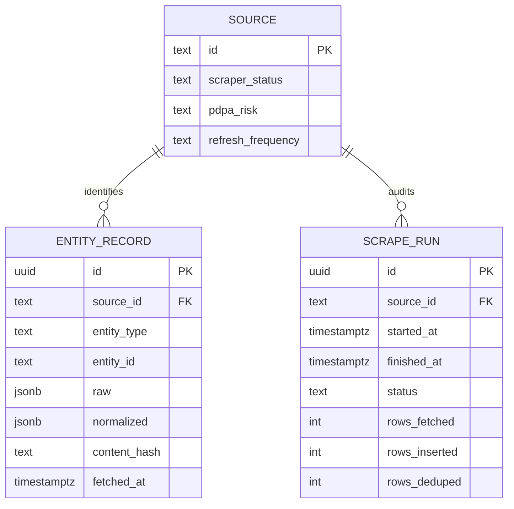

# Source policy, normalized records, and PostgreSQL model

The repository uses a catalogue-driven model: every candidate source has operational and policy metadata, while every ingested item uses one shared PostgreSQL envelope plus a source-specific normalized JSON document.

## Source catalogue and policy

`sources.yaml` is the source of record for configured data sources. It assigns each source an ID, URL, type, refresh frequency, lifecycle status, `pdpa_risk`, licence note, and operational notes. The active entries are `eperolehan` and `data_gov_my`; all other entries are candidates without registered scraper classes.

`Scraper.run()` uses `pdpa_risk` as an execution gate: a value of `high` raises before fetching. The catalogue marks KKMNOW as high-risk and says individual-level health records must not be ingested. It marks ePerolehan and data.gov.my as low-risk, with source-specific licence caveats.

For procurement, `schemas/procurement.yaml` further narrows contact handling: the optional `contact` block may contain agency unit, role title, office landline, and generic agency email, but schema documentation forbids names, personal mobile numbers, and personal email addresses. This policy configures the [shared architecture](../architecture/overview.md) and must remain true in the [ePerolehan workflow](../workflows/ingestion.md).

## Storage model

This diagram represents the tables in `sql/schema.sql`. A `source` can identify many stored records and audit runs. `entity_record` uses a source-native identity and retains JSONB payloads; `scrape_run` records a source execution’s outcome.

### `source`

The reference table mirrors the catalogue enough to support foreign keys. Its primary key is the stable source ID, such as `eperolehan` or `data_gov_my`. It also records status/risk and descriptive metadata.

**Current blocker:** the schema contains only commented sample seed SQL. There is no inspected implementation that imports `sources.yaml` into this table, even though both stored records and scrape-run records require an existing source ID.

### `entity_record`

This is the vertical-agnostic record table. The unique constraint is `(source_id, entity_type, entity_id)`, so identity is scoped to a source and entity class. It also contains search-friendly columns (`title`, `agency`, `category`, `value_band`, `location`, `url`), timestamps, `content_hash`, and JSONB `raw`/`normalized` payloads. Indexes cover source/type, hash, fetch time, and JSONB querying.

A `NormalizedRecord.content_hash()` is a stable SHA-256 of sorted normalized JSON. However, the concrete store implementations deduplicate through the unique identity conflict—not an explicit hash lookup—and execute `ON CONFLICT ... DO NOTHING`. A changed source record with the same identity therefore is not updated or versioned.

Also note the retention discrepancy: `ProcurementScraper.store()` and `DataGovMyScraper.store()` serialize `record.normalized` into both `raw` and `normalized`. The original `RawRecord.raw` is not persisted by those implementations. Any change to the data-product claim of raw retention must first resolve this behavior.

### `scrape_run`

The audit table captures source, start/finish times, terminal status, fetch/insert/dedup counters, optional error message, and metadata. `Scraper.run()` classifies a run as `success` when no per-record errors occur or `partial` otherwise. Each active scraper overrides the base hooks to insert/open and update/close a real audit record.

## Vertical contracts

| Entity type | Active source | Contract | Required domain fields | Notes |
| --- | --- | --- | --- | --- |
| `procurement_tender` | `eperolehan` | `schemas/procurement.yaml` | tender ID, title, agency, category, MYR currency, URL | Supports listing fields and optional detail enrichment, including indicative value and Kod Bidang. |
| `open_dataset` | `data_gov_my` | `schemas/open_dataset.yaml` | dataset ID, observation date, title, agency, URL | Additional source-specific fields are allowed for time-series rows. |

Both contracts are validated immediately before building the persistence envelope in the respective scraper. The [testing guide](../operations/testing.md) includes negative validation checks and store/idempotency checks; run them whenever required fields or identity construction change.

## Change guidance

- Add source metadata in `sources.yaml` before implementing acquisition. `SourceConfig` only models a subset of its fields, so keep policy narrative in the YAML source of truth.
- Add a vertical schema before persisting a new entity type, and keep its required fields compatible with the source’s actual data.
- Do not weaken the procurement contact policy without policy/legal review.
- If implementing updates/versioning, decide whether the unique key, content hash, raw retention, and audit counters change together; they are coupled persistence semantics.
