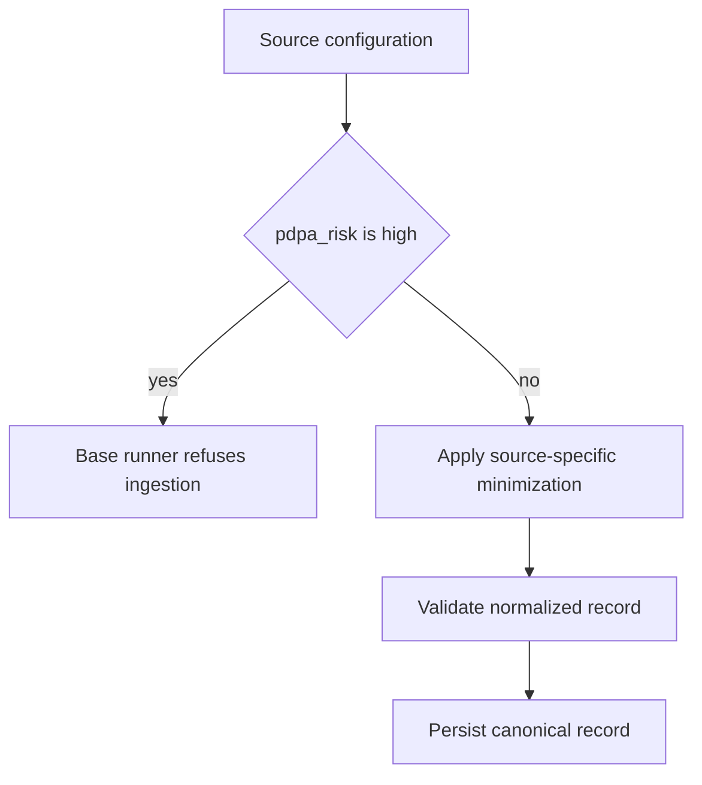

# Sources, product verticals, and governance

`sources.yaml` is the canonical registry of potential Malaysian public-data sources. It gives each source a stable ID, endpoint, access type, refresh cadence, implementation status, PDPA risk, license note, and operational note. The database `source` table mirrors this metadata conceptually, but it is not automatically seeded; see the [operations runbook](../operations/runbook.md).

The product intent from `README.md` is to collect public data, normalize it into reusable records, retain an audit trail, and package curated subsets for licensed resale. The shared storage model in [architecture overview](../architecture/overview.md) deliberately allows different verticals to coexist under one `entity_record` table.

## Portfolio and implementation status

| Vertical / source | Status in `sources.yaml` | Intended role | Practical boundary |
|---|---|---|---|
| ePerolehan procurement | `active` | Tender lead and procurement intelligence | Implemented Camofox workflow with optional detail fields; verify MOF redistribution terms. |
| data.gov.my | `active` | Open-data time series; initial `fuelprice` dataset | CC BY 4.0 attribution stated in registry; current implementation is date-keyed and bounded by first API window. |
| JPPH NAPIC e-Data | `pending` | Property-transaction vertical | Paid record-level access; application required. |
| SSM e-Info | `pending` | Company-registry vertical | Bulk access should precede scale; director information needs additional care. |
| BNM, OpenDOSM, MetMalaysia | `pending` | Join/enrichment or regulatory context | Registry positions several as complements rather than standalone resale products. |
| KKMNOW | `pending`, `high` risk | Parked health data | Do not build individual-level ingestion; only aggregate official statistics are noted as possible scope. |
| MyInvois SDK | `pending`, `medium` risk | Schema/join validation possibility | Public schema does not imply access to invoice records. |

The [ingestion workflows](../workflows/ingestion.md) page explains only the two working integrations. A `pending` registry entry is not evidence of a working scraper.

## Risk guardrail and data minimization

This shows the actual code-enforced high-risk block and the required policy boundary around it. `Scraper.run()` refuses `pdpa_risk == "high"`, but low/medium classifications are not automatically sanitized by the base class. Source owners must still minimize fields, validate licensing, and review terms before operating or redistributing a dataset.

For procurement, `schemas/procurement.yaml` explicitly allows only agency/role-oriented contact metadata: agency unit, role title, office landline, and generic agency email. Its descriptions prohibit personal names, mobiles, and personal email addresses. The current detail parser does not extract the portal's named-contact table, which is safer than attempting to retain it. This requirement is carried into the ePerolehan workflow in [ingestion workflows](../workflows/ingestion.md).

## Licensing and commercial claims

This repository records operator assumptions and source-specific license notes; it does not implement a legal compliance engine. `README.md` makes broad commercial and PDPA claims and points to external references, but the practical operational requirements are narrower:

1. Verify the source's terms and redistribution rights before publishing a product.
2. Treat public availability as distinct from resale permission.
3. Exclude direct identifiers and review any medium/high-risk data manually.
4. Recheck regulatory guidance before product launch; README itself calls for a fresh check of PDPA guidance.
5. Capture the final source/license decision in `sources.yaml` and test the corresponding scraper behavior.

## Change guide

When adding or activating a source, update `sources.yaml`, a compatible schema, a registered scraper, and coverage together. The canonical source ID must match the scraper's `source_id`; it becomes a foreign key and part of record identity. Follow the [architecture overview](../architecture/overview.md) for identity implications and [testing guidance](../operations/testing.md) for checks.
