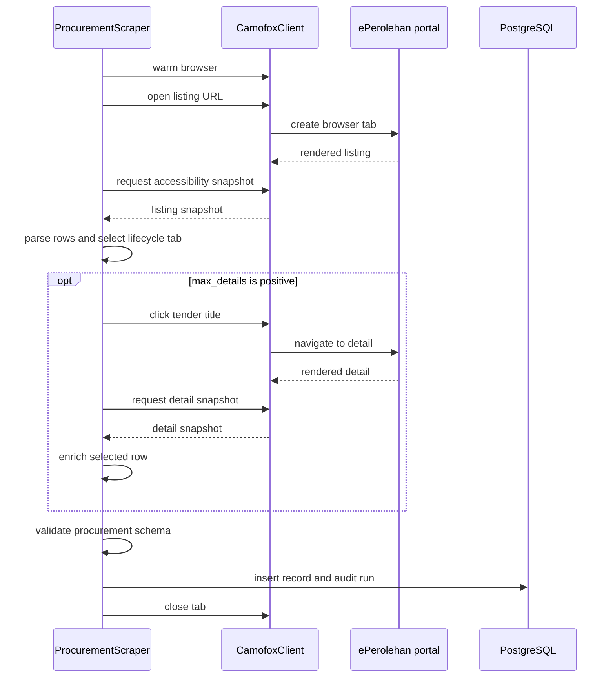
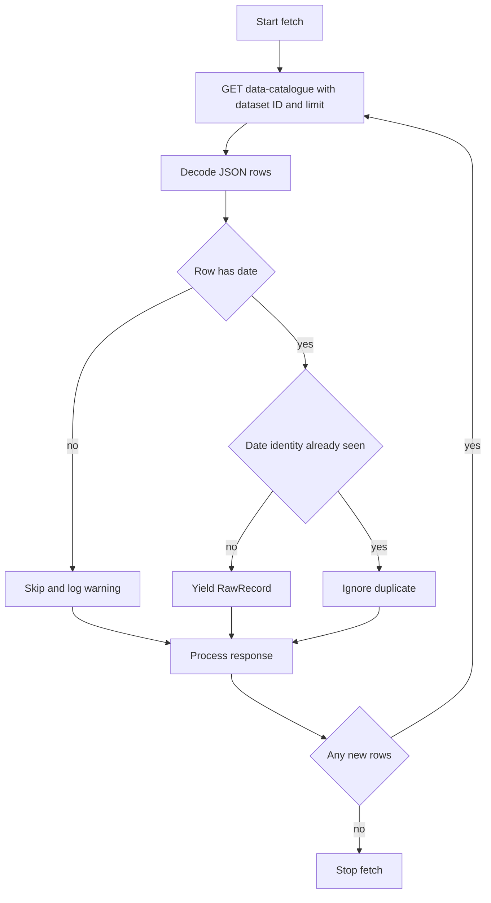

# Active ingestion workflows for ePerolehan and data.gov.my

Both registered scrapers implement the [shared architecture](../architecture/overview.md): source records are fetched, extracted into a schema-shaped dictionary, validated, enveloped as `NormalizedRecord`, and stored with an audit run. They diverge at acquisition: ePerolehan is a JavaScript portal controlled through Camofox, while data.gov.my is an HTTP JSON API.

## ePerolehan procurement notices

`ProcurementScraper` (`scrapers/procurement.py`) represents source `eperolehan` and entity type `procurement_tender`.

This sequence is the implemented Camofox listing/detail path. Detail clicks are optional and limited to the first `max_details` entries.

### Listing, lifecycle, and identity

The scraper opens `https://www.eperolehan.gov.my/quotation-tender-notice`, waits for rendering, and parses Camofox’s text accessibility snapshot using `_parse_listing_snapshot()`. It supports these `tab` values: `diklankan`, `notis_dikemaskini`, `ditutup`, `selesai`, and `dibatalkan`. Each maps to a current page reference in `TAB_REFS`.

Identity includes lifecycle state: `eperolehan:<tab>:<tender-ref-or-title-ref>`. This was reinforced by the recent lifecycle-tab and enriched-identity work, so do not remove the tab segment without revisiting conflict/dedup semantics in the [data model](../domain/data-model.md). The listing parser deliberately uses grid cells 1 onward for agency/date fields because cell 0 repeats the title.

### Detail enrichment and retries

If `max_details > 0`, the scraper clicks the first selected listing records and parses their snapshots with `_parse_detail_snapshot()`. Enrichment can add ministry, numeric indicative value, procurement method, supplier status, coverage area, validity days, and Kod Bidang hierarchy. Tests use `tests/fixtures/eperolehan_detail_sample.txt` to keep this parser reproducible offline.

`_click_with_snapshot_retry()` handles errors containing `retryable` by refreshing the snapshot, waiting, and retrying one click. The latest supplied commit specifically stabilized this behavior and enriched identities. Keep this narrowly scoped retry behavior and its tests when changing Camofox interaction.

### Extraction, validation, and storage

`extract()` assigns a coarse title-based category: ICT, Construction, or `Umum`; converts recognized Malaysian dates to ISO dates; carries listing metadata in `supplementary`; and preserves any detail fields. `normalize()` validates with `schemas/procurement.yaml` and uses the source entity identity where present.

`store()` inserts into `entity_record` and returns whether `RETURNING id` produced a row. It uses `ON CONFLICT (source_id, entity_type, entity_id) DO NOTHING`; repeat ingestion is therefore idempotent by identity, not an update operation. It also overrides the audit hooks to write `scrape_run`. These semantics are centralized in the [data model](../domain/data-model.md).

## data.gov.my date-keyed observations

`DataGovMyScraper` (`scrapers/data_gov_my.py`) represents `data_gov_my` and entity type `open_dataset`. Its active catalogue note calls out the `fuelprice` dataset as the Phase 1 target, though the class accepts a configurable `dataset_id`.

This flow is the defensive response to the API behavior recorded in code: `offset` and date filters were observed to be ignored, returning the same window repeatedly.

### Fetch behavior and retries

The scraper requests `https://api.data.gov.my/data-catalogue` with `id` and a default `limit` of 500. It forms identities as `<dataset_id>:<date>`, tracks them in memory, yields only unseen rows, and ends once a response adds no new identities. `_fetch_page()` retries HTTP 429 and 5xx failures up to three attempts with exponential waiting; it does not retry other client errors.

`tests/test_data_gov_my_pagination.py` locks in repeated-window behavior. Do not introduce normal offset traversal alone unless the upstream behavior is reverified and the dedup/end condition is retained or intentionally replaced.

### Extraction, validation, and storage

`extract()` adds dataset ID, date-derived title, agency mapping, canonical catalogue URL, optional series type, and the source row’s other fields. `_agency_for_dataset()` has explicit mappings for several known IDs and otherwise returns `Unknown`.

`normalize()` validates against `schemas/open_dataset.yaml`; `store()` uses the same SQL identity-conflict behavior and audit override as procurement. The generic persistence limitations—no source seeding workflow, normalized JSON copied to `raw`, and no update-on-change behavior—apply to both workflows.

## Change checklist

- **Portal selectors/references:** update fixture snapshots and listing/detail parser tests; verify every supported lifecycle tab.
- **Camofox behavior:** preserve cleanup in `finally`, failure retry coverage, and the distinct Camofox deployment requirement in the [runbook](../operations/runbook.md).
- **Procurement fields:** update `schemas/procurement.yaml`, extraction, fixture tests, and store/E2E tests together; preserve privacy rules.
- **data.gov.my fields/paging:** update open-dataset schema tests and repeated-window tests before live E2E execution.
- **Persistence changes:** consult the [data model](../domain/data-model.md) and run database-backed idempotency tests for both sources.
